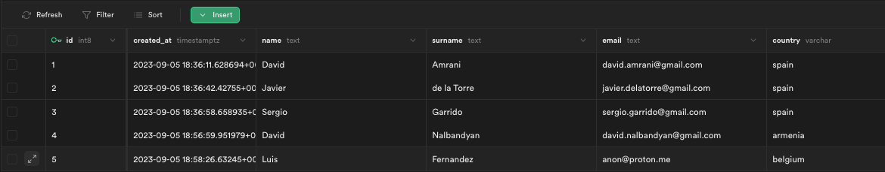
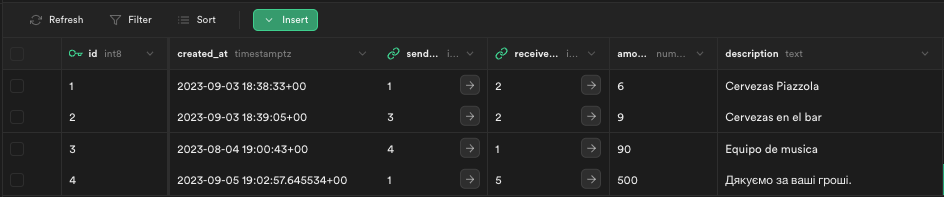

# 1. Crear la base de datos

Para crear la base de datos se utilizará el servicio supabase.io,
que es un servicio de base de datos PostgreSQL con una capa de API REST por encima.

Para crear la base de datos se debe crear un proyecto en supabase.io
y crear una base de datos con el nombre `fraud`.

Esta fase consta los siguientes pasos:
 1. Crear una cuenta y la base de datos
 2. Crear las tablas `users` y `transactions`
 3. Ingestar datos de prueba

---

## 1.1 Crear una cuenta y la base de datos

Entramos en [supabase.io](https://supabase.io/) y creamos una cuenta con nuestro correo electrónico.  
Es totalmente gratuita, no pide datos de pago y es super sencillo.
Una vez creada la cuenta, en la página principal nos aparecerá un botón para crear un nuevo proyecto
donde introduciremos los siguientes datos:
 - **Project name**: `fraud`
 - **Password**: `**********` (cualquier contraseña)
 - **Region**: `Central EU (Frankfurt)`

Ya tenemos nuestra cuenta y proyecto creados. A la izquierda vemos un menú con varias opciones,
entre ellas `Database` que es donde vamos a crear nuestras tablas.

---

## 1.2 Crear las tablas `users` y `transactions`

En el menú de la izquierda seleccionamos `Database` y luego iremos a `Tables`.  
Arriba a la derecha nos aparece el botón `New table` donde crearemos las tablas `users` y `transactions`
con los siguientes campos:

### Tabla users
| Name       | Type      | Default value | Primary | Nullable | Unique | Array | Identity |
| ---------- | --------- | ------------- | ------- | -------- | ------ | ----- | -------- |
| id         | int8      |               | ✅       | ❌        | ❌      | ❌     | ✅        |
| created_at | timestamp | now()         | ❌       | ❌        | ❌      | ❌     | ❌        |
| name       | text      |               | ❌       | ❌        | ❌      | ❌     | ❌        |
| surname    | text      |               | ❌       | ❌        | ❌      | ❌     | ❌        |
| email      | text      |               | ❌       | ❌        | ✅      | ❌     | ❌        |
| country    | text      | 'spain'       | ❌       | ❌        | ❌      | ❌     | ❌        |

### Tabla transactions

Cuando vayamos a indicar los campos `sender_id` y `receiver_id` debemos indicar que son
claves foráneas de la tabla `users`. Para ello hay que hacer click en el icono del enlace
que aparece a la derecha del campo y seleccionar la tabla `users` y el campo `id`.

En el campo `action` cambiaremos el valor a `Set default` que indica que si se borra el usuario
no se borrará la transacción, simplemente se pondrá a `null` o el valor por defecto que indiquemos.

| Name        | Type      | Default value | Primary | Foreign | Nullable | Unique | Array | Identity |
| ----------- | --------- | ------------- | ------- | ------- | -------- | ------ | ----- | -------- |
| id          | int8      |               | ✅       |         | ❌        | ❌      | ❌     | ✅        |
| created_at  | timestamp | now()         | ❌       |         | ❌        | ❌      | ❌     | ❌        |
| sender_id   | int8      |               | ❌       | user.id | ❌        | ❌      | ❌     | ❌        |
| receiver_id | int8      |               | ❌       | user.id | ❌        | ❌      | ❌     | ❌        |
| amount      | numeric   |               | ❌       |         | ❌        | ❌      | ❌     | ❌        |
| description | text      |               | ❌       |         | ✅        | ❌      | ❌     | ❌        |

---

## 1.3 Ingestar datos de prueba

Para poder probar el script en Python necesitamos tener datos en la base de datos.
Para ello vamos a pinchar en el segundo botón del menú lateral (`Table Editor`) y
seleccionaremos la tabla `users`, donde veremos una tabla vacia y un botón `Insert`.

En la tabla `users` he insertado los siguientes datos:

En la tabla `transactions` he insertado los siguientes datos:

Aquí sobre el papel podemos ver que hay una transacción que parece fraudulenta,
la transacción con `id=4` donde el usuario `id=1` envía dinero al usuario `id=5`
con el concepto `Дякуємо за ваші гроші.` y un importe de `500`. Veremos como hacerlo en código.