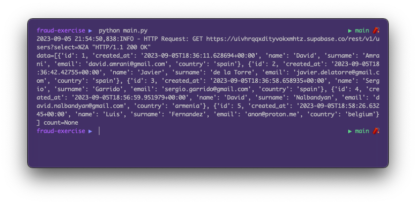
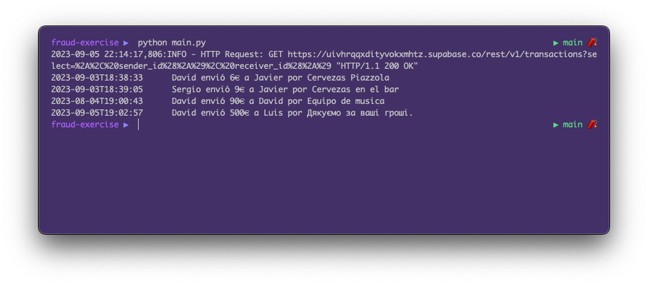

# 2. Crear el script en Python

Para crear el script en Python se debe crear un archivo llamado `main.py` el cual
se conectará a la base de datos de supabase.io y leerá los datos de la tabla `transactions`.

Una vez podamos obtener todas las filas de la tabla `transactions` podremos pasar al siguiente punto.

## 2.1. Crear el archivo `main.py`

Vamos a crear un fichero llamado `main.py` en la raíz del proyecto y vamos a añadir el siguiente código:

```python
import os
from supabase.client import create_client, Client

supabase_url = ""
supabase_key = ""

supabase: Client = create_client(supabase_url, supabase_key)

transactions = supabase.table("users").select("*").execute()
print(transactions)
```

Como vemos, tenemos 2 variables que debemos definir:
* `SUPABASE_URL`: La URL de nuestra base de datos de Supabase. Gracias a esto Python donde está nuestra base de datos, cómo se llama y cómo conectarse a ella.
* `SUPABASE_KEY`: La clave de acceso a nuestra base de datos que nos permitirá leer los datos de las tablas.

Si ejecutamos esto vamos a obtener un error. Vamos a ello en el siguiente punto.

## 2.2. Conectarse a la base de datos

Básicamente, ya tenemos nuestras tablas y nuestros datos, pero solo son visibles desde el navegador donde estamos
logueados. Lo que vamos a hacer es gestionar los permisos de acceso para que nuestra clave (que ahora la obtendremos)
pueda leer los datos de nuestras tablas.

### 2.2.1. Obtener las claves

Vamos a Supabase y en el menú de la izquierda vamos a hacer click en `Project Settings` y luego en `API`.
Aquí es donde obtendremos los siguientes datos:
* Project URL > **URL**: Es el valor que debemos poner en la variable `SUPABASE_URL`.
* Project API keys > **anon / public**: Es el valor que debemos poner en la variable `SUPABASE_KEY`.

🚨 ¡Ojo! No debemos confundir la clave `anon / public` con la clave `service_role` que está justo debajo.

### 2.2.2. Conceder permisos de lectura

Vamos a ir a Supabase y en el menú de la izquierda vamos a hacer click en `Authentication` y luego en `Policies`.
Aquí es donde configuramos los permisos de acceso que queremos a cada una de nuestras tablas.

Vamos a ir a la primera tabla: `transactions` y vamos a crear una nueva política de acceso haciendo click en el botón `New Policy`.
Seleccionaremos `Get started quickly` > Seleccionamos `Enable read access for all users` y `Use this template` > `Review` > `Save policy`.
Esto hará que cualquiera que tenga nuestra clave pública pueda leer los datos de la tabla `transactions`.

Haremos lo mismo para la tabla `users`. Gracias a esto, nuestra clave `anon / public` podrá leer los datos de las tablas `transactions` y `users`.


## 2.3. Leer los datos de la tabla `transactions`

Ahora que ya tenemos los permisos de acceso, vamos a volver a ejecutar el script `main.py` y veremos que nos devuelve un objeto con los datos de la tabla `transactions`.



No es muy legible así que vamos a cambiar el código para que nos devuelva los datos en formato más legible. 
Recuerda cambiar la URL y la KEY en el código. Si lo ejecutamos veremos que el resultado es mucho más legible.

Aunque haya cosas que no entiendas en el código, no te preocupes, lo veremos en el siguiente punto 
([Crear reglas de detección de Fraude](3_fraud.md)) y explicaremos que hace cada linea. Pero si lo lees con calma
verás que es bastante sencillo y deducible.

```python
import os
from supabase.client import create_client, Client

supabase_url = "INSERTA_AQUI_TU_URL"
supabase_key = "INSERTA_AQUI_TU_CLAVE"

supabase: Client = create_client(supabase_url, supabase_key)

def get_users():
    query = "*"
    return supabase.table("users").select(query).execute().data

def get_transactions():
    query = "*, sender_id(*), receiver_id(*)"
    return supabase.table("transactions").select(query).execute().data

transactions = get_transactions()
for transaction in transactions:
    sender = transaction["sender_id"]["name"]
    receiver = transaction["receiver_id"]["name"]
    amount = transaction["amount"]
    reason = transaction["description"]
    timestamp = transaction["created_at"][:19]

    print(f"{timestamp}\t {sender} envió {amount}€ a {receiver} por {reason}")
```


