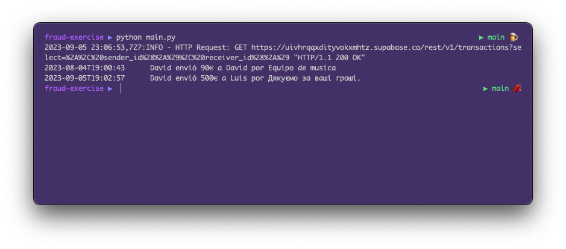

# 3. Crear reglas de detección de Fraude

## 3.1. Entendiendo el código

Vamos a ver el código que tenemos hasta ahora:

```python
def get_users():
    query = "*"
    return supabase.table("users").select(query).execute().data

def get_transactions():
    query = "*, sender_id(*), receiver_id(*)"
    return supabase.table("transactions").select(query).execute().data

transactions = get_transactions()
for transaction in transactions:
    sender = transaction["sender_id"]["name"]
    receiver = transaction["receiver_id"]["name"]
    amount = transaction["amount"]
    reason = transaction["description"]
    timestamp = transaction["created_at"][:19]

    print(f"{timestamp}\t {sender} envió {amount}€ a {receiver} por {reason}")
```

En este código tenemos 2 funciones para obtener los datos de las tablas `users` y `transactions`.  
Estas funciones, obviamente, nos devuelve una lista de objectos (diccionarios) con los datos de las tablas.

La variable `query` nos permite seleccionar los campos que queremos obtener de la tabla. Si ponemos `*` 
nos devolverá todos los campos. Sin embargo, en la tabla `transactions` tenemos 2 campos que son `sender_id` y `receiver_id`
y estos campos son referencias a la tabla `users`. Por lo tanto, si queremos obtener los datos de los usuarios
que han realizado la transacción, debemos añadir `sender_id(*)` y `receiver_id(*)` en la query.  
De no ponerlos, nos devolvería unicamente el id del usuario y nos interesan otros datos como el nombre, el email, la nacionalidad...

Una vez declaradas las funciones, obtener las transacciones en la variable `transactions` y las recorremos con un bucle `for` para
imprimir los datos de cada transacción.

## 3.2. Crear la función `is_fraud`

Para crear las reglas de detección de fraude vamos a crear una función que nos permita
crear las reglas de detección de fraude. Esta función recibirá como parámetros la transacción
y devolverá `True` si lo considera fraude y `False` en caso contrario.

Para ello vamos a crear la funcion devolviendo `False` por defecto y luego iremos añadiendo
las reglas de detección de fraude.

Tambien vamos a cambiar el bucle `for` para que imprima la transacción en caso de que la función
`is_fraud` devuelva `True`, es decir, en caso de que lo detecte como fraudulenta.

Añade el siguiente código a tu script `main.py`:

```python
def is_fraud(transaction):
    return False

transactions = get_transactions()
for transaction in transactions:
    if is_fraud(transaction):
        sender = transaction["sender_id"]["name"]
        receiver = transaction["receiver_id"]["name"]
        amount = transaction["amount"]
        reason = transaction["description"]
        timestamp = transaction["created_at"][:19]

        print(f"{timestamp}\t {sender} envió {amount}€ a {receiver} por {reason}")
```

Si lo ejecutamos, veremos que no muestra ninguna transacción porque la función `is_fraud` devuelve `False` por defecto.
Pero si lo cambiamos a `True` veremos que nos muestra todas las transacciones.

Entonces nuestra función `is_fraud` ya funciona correctamente. Ahora vamos a añadir las reglas de detección de fraude.

## 3.3. Añadir reglas para detectar el fraude

Ahora lo único que tenemos que hacer es ir añadiendo condiciones a la función `is_fraud` para que detecte
las transacciones fraudulentas. Si la transacción cumple con alguna de las condiciones, devolveremos `True` y si no, `False`.

```python
def is_fraud(transaction):
    sender = transaction["sender_id"]
    receiver = transaction["receiver_id"]
    amount = transaction["amount"]
    description = transaction["description"]
    # Sender details
    sender_name = sender["name"] + " " + sender["surname"]
    sender_email = sender["email"]
    sender_country = sender["country"]
    # Receiver details
    receiver_name = receiver["name"] + " " + receiver["surname"]
    receiver_email = receiver["email"]
    receiver_country = receiver["country"]

    # Si pais de origen y destino es diferente, es fraude
    if sender_country != receiver_country:
        return True

    # Si el monto es mayor a 4000€, reportar como fraude
    if amount > 4000:
        return True

    # Si el emisor y el receptor son la misma persona, es fraude
    if sender == receiver or sender_email == receiver_email or sender_name == receiver_name:
        return True

    # @proton.me son emails usados por criminales, reportar como fraude
    if "@proton.me" in sender_email:
        return True

    return False
```



Si lo ejecutamos, podemos ver que solo nos muestra 2 transacciones, que son las que hemos marcado como fraudulentas.
La 1ª transacción es fraudulenta porque el emisor y el receptor son de distintos paises (España y Armenia).
La 2ª transacción es fraudulenta porque el email del receptor es un email usado por criminales (proton.me).

Lo puedes corroborar en la imagen que pusimos al principio con los datos de la tabla `users`:

